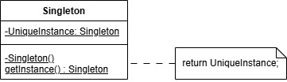

# Лаборатория №1

   Для выполнения лабораторной работы был определен порождающий паттерн проектирования **Одиночка** или *Singleton* .

# Предметная область
   Была выбрана следующая предметная область: Обработка событий и очередей. В пример можно привести taskmanager. Он занимается тем, что назначает обработчику очередь событий. В этой ситуации просто напрашивается использование паттерна *Одиночка*, который будет решать ряд следующих проблем.
# Описание проблемы
   Проблемы могут возникать на следующих этапах: 
- Есть два свободных обработчика и одна очередь и наоборот. Обработчики стараются занять одну очередь, возникает Race condition.
- Неоднозначность определения очередей обработчикам

# Решение
   Использование паттерна 
# Диаграмма классов

