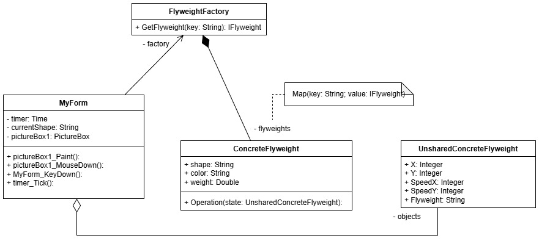
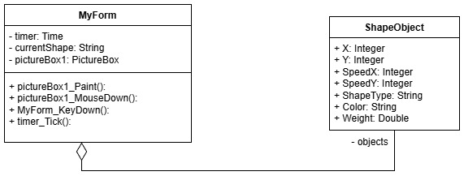

# Лаборатория №2

Для выполнения лабораторной работы был определен порождающий паттерн проектирования **Легковес** или *Приспособленец* . Необходимо предоставить реализацию программы как с паттерном, так и без него. 

### Предметная область

Для демонстрации работы паттерна, была придумана следующая задача: Реализовать консольное приложение, в котором будет окно, на котором будут передвигаться одни из 3 фигур, с соответствующими цветами и особенностями, по типу веса.
  
### Описание проблемы

Суть проблемы заключается в том, что у объектов могут быть внутренние и внешние состояния. Внутренние состояния - это свойства характерные сразу множеству объектов, они статичны и не меняются по ходу программы. Внешние состояния - это свойства, которые являются уникальными для каждого объекта и не могут быть разделены. 

### Решение
   Использование паттерна *Приспособленец*.
   
   Внешними состояниями будут являться:
   1. Положение по оси X.
   2. Положение по оси Y.
   3. Скорость по оси X.
   4. Скорость по оси Y.

   Внутренними состояниями будут:
   1. Форма
   2. Цвет 
   3. Вес

### Диаграмма классов. Реализация с паттерном

### Диаграмма классов. Реализация без паттерна

### Выводы

 Завершив лабораторную, нельзя не отметить такие преимущества паттерна «Приспособленец», как разделение полей и, как следствие, снижение нагрузки на ОЗУ, которые помогли добиться удовлетворительных результатов.

