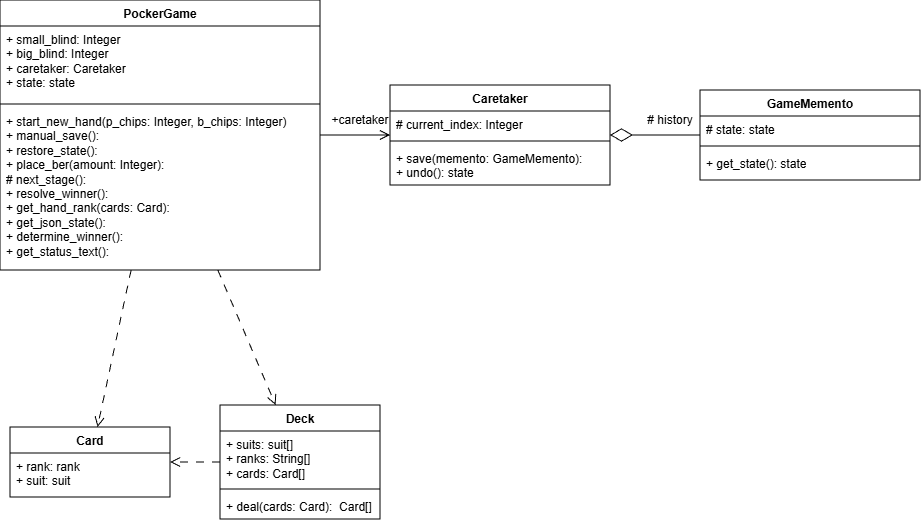
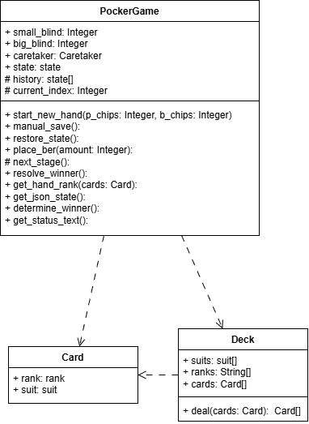

# Лабораторная №3

Для выполнения лабораторной работы был определен паттерн поведения **Хранитель** или *снимок* . Необходимо предоставить реализацию программы как с паттерном, так и без него. 

### Описание проблемы

Суть проблемы заключается в том, что для создания копии объектов, с целью сохранения промежуточного результата, для отката на более раннюю версию, можно сделать public поля, необходимых свойств, но в дальнейшем, это полностью затруднит разработку новых классов, ссылаясь на старые, это называется проблемой инкапсулирования. Решением это проблемы является создание специальных классов *Создателя* и *Снимка*, что бы когда *Опекун* решил создать или посмотреть предыдущее состояние, он обращался бы к *Снимку*, и тот бы возращал состояние *Создателя*.

### Предметная область

За основу была взята такая карточная игра, как покер. В ней присутствуют 4 этапа после раздачи карт: Флоп, Терн, Ривер, Шоудаун. На каждом из этих этапов игрок может делать ставки и открывать следующую карту. Применяя паттерн *Хранитель* можно сохранять такие поля, как: Карты на столе и в руках у соперника (бота) и у игрока, фишки бота, игрока и стола. При нажатии кнопки **Откатиться обратно** игрок будет возращен на тот этап игры с теми картами и фишками, когда он нажал кнопку **Сохранить точку**. Во время *Шоудаун* просчитываютя комбинации карт на руках у игрока и бота. Чья комбинация карт будет старше, тот и выиграл.

### Диаграмма классов. Реализация с паттерном

### Диаграмма классов. Реализация без паттерна

### Выводы
