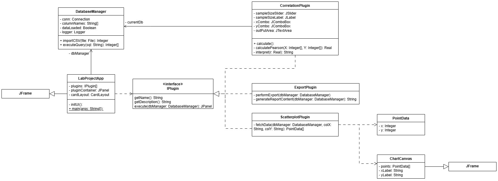

# Лабораторная №4

Для выполнения лабораторной работы был определен паттерн поведения **Дополнительный модуль** или *Плагин* . Необходимо предоставить реализацию программы как с паттерном, так и без него. 

### Описание проблемы

В проекте есть основное ядро, которое заточено для выполнения какой-то отдельно поставленной задачи. Добавляя в него новые подпрограммы, мы размываем его, тем самым делая его трудно отделимым. Чтобы это предотвратить, можно выделить отдельный интерфейс, к которому будут подсоединятся плагины, которые будут расширять функционал программы.

### Предметная область

За основу был взят ядро - которое будет переводить данные из CSV файла и записывать их в базу данных (SQLlite). Было реализовано 4 плагина: 
    1) Describe - описывает выборку, показывает Макс, Среднее, Мин значения
    2) Scatterplot - Строит диаграмму рассеивания для выборки
    3) Корреляция - считает коэф. Корреляции Пирсона
    4) Экспорт - экспортирует данные в текстовый файл.

### Диаграмма классов. Реализация с паттерном

### Диаграмма классов. Реализация без паттерна

### Выводы

При реализации программы было достигнуто то, что программа не размывается дополнительным функционалом, за счет использования паттерна, который реализуется через интерфейс.